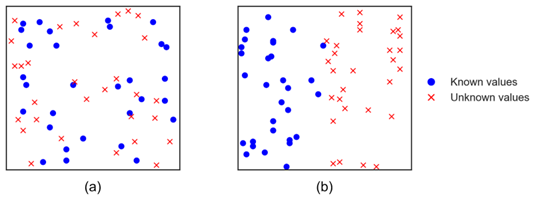
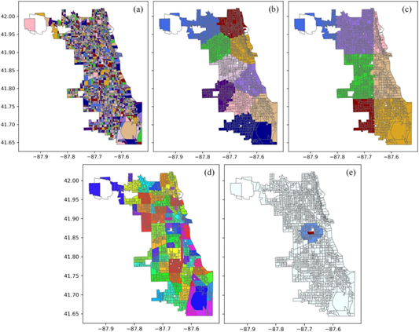
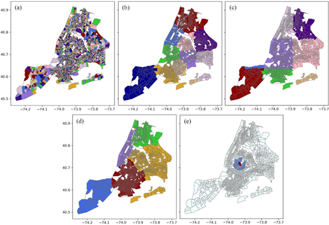

# Spatial cross-validation for GeoAI

### Overall description
Cross-validation (CV) has been widely used in GeoAI research to evaluate the performance of machine learning models. Often, a labeled data set is randomly split into training and validation data, and a machine learning model is trained on the training data and then evaluated on the validation data in an iterative manner. Such a random CV approach could lead to an overestimate of model performance on geographic data, due to the existence of spatial autocorrelation. Random CV can generate many training and validation data instances that are spatially close, and a model trained on such training data can be considered as having already “peeked” into the nearby validation data, given their spatial closeness and likely attribute similarity. Spatial CV can help address this issue by splitting the data spatially rather than randomly, thereby increasing the independence between the training and validation data. While a number of spatial CV methods have been developed, they are scattered in the literature across multiple disciplines, including ecology, remote sensing, GIScience, and computer science. This chapter discusses four main spatial CV methods identified from the multidisciplinary literature, and uses two examples based on real-world data to demonstrate these methods in comparison with random CV.

This repository contains the code and data for implementing random CV approach and four spatial CV approaches (i.e., clustering-based spatial CV, grid-based spatial CV, geo-attribute-based spatial CV, and spatial leave-one-out CV).

 
 

 
Figure 1. An illustration of two common situations under which machine learning models are applied to geographic data: (a) within-area prediction or interpolation; (b) between-area prediction or extrapolation.

 
 

 
Figure 2. Data splitting results for CBGs in Chicago: (a) random CV; (b) clustering-based spatial CV; (c) grid-based spatial CV; (d) geo-attribute-based spatial CV; (e) spatial leave-one-out CV.

 

 
 

 
Figure 3. Data splitting results for census tracts in NYC: (a) random CV; (b) clustering-based spatial CV; (c) grid-based spatial CV; (d) geo-attribute-based spatial CV; (e) spatial leave-one-out CV.

 

### Repository organization

* The folder "Code" contains the code used for implementing the two examples to demonstrate the random CV approach and four spatial CV approaches.
* The folder "Data" contains the experimental data for the two examples including domestic violence data, obesity rate data, and shapefile data used for spatial components.
 

### Technical issue
We use the *spacv* library to implement both grid-based spatial CV and spatial leave-one-out CV. There are two minor technical issues that require attention when using the library. 
* This library used the *asPolygon* function from the *shapely* library, which has been replaced by the *Polygon* function in the latest version of *shapely*. Therefore, before importing *spacv*, it is required to replace *asPolygon* function with *Polygon* function in this library, specifically in the Python file of *grid_builder.py*. If you have started the jupyter notebook kernel prior to making this revision, you need first make revisions and then restart the kernel.      
* There is one line code "train_excluded = np.concatenate([test_indices, train_excluded])" in the Python file *base_classes.py* to obtain all samples which cannot be used as training samples. When you use spatial leave-one-out CV, samples within the buffer zone surrounding the test sample will not be used for training. This line of code will basically combine the test samples and samples within the buffer zone into samples excluded for training, and it can run without any error. However, when you use grid-based spatial CV, and you set the buffer_radius as 0 (i.e., there is no a buffer zone around the test samples), there will be an error with the code. This is because that there is no any samples within a buffer zone, which can be be combined with the test samples. Therefore, you have to manually revise this line to "train_excluded = test_indices". Then the code will run smoothly. To make it clear, there are situations:  
  - If you use grid-based spatial CV with the buffer_radius as 0, you will need to modify this line code to "train_excluded = test_indices". Note that you also need to restart the kernel to make the code take effect. 
  - If you use spatial leave-one-out CV or you use grid-based spatial CV with the buffer_radius larger than 0, you do not need to revise the code and just use "train_excluded = np.concatenate([test_indices, train_excluded])".
 
 
### Creating and using a virtual environment  

With Anaconda:  

- conda create --name <name_of_your_enviornment> --file requirements.txt

